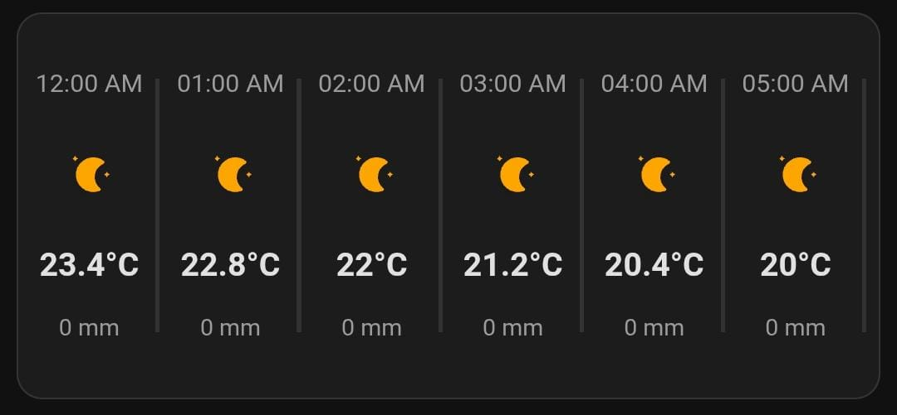

# 🌤️ Horizontal Forecast Card

A modern, responsive horizontal weather forecast card for Home Assistant Lovelace UI with intuitive drag-to-scroll functionality.

[](https://github.com/Matbe34/Horizontal-Forecast-Card/releases)
[](https://github.com/hacs/integration)
[](LICENSE)
[](https://github.com/hacs/integration)

## ✨ Features

- **🌡️ Hourly Weather Display** - Temperature, conditions, and precipitation probability
- **🖱️ Intuitive Drag-to-Scroll** - Smooth mouse and touch drag functionality  
- **📱 Mobile Optimized** - Responsive design with perfect touch support
- **⚡ Lightning Fast** - Local SVG icons for instant loading (no CDN dependency)
- **🎨 Modern UI** - Clean design with visual separators and smooth animations
- **🔄 Smart Caching** - Intelligent data caching with automatic refresh
- **🌐 Cross-browser Compatible** - Works on all modern browsers

## 🖼️ Preview



### Desktop View


### Mobile View  


## 🚀 Installation

### Method 1: HACS (Recommended)

1. Open HACS in your Home Assistant instance
2. Go to "Frontend" section
3. Click the "+" button and search for "Horizontal Forecast Card"
4. Click "Install"
5. Add the resource to your Lovelace configuration

### Method 2: Manual Installation

1. Download the latest `horizontal-forecast-card.js` from [releases](https://github.com/Matbe34/Horizontal-Forecast-Card/releases)
2. Copy the file to your `config/www/` directory
3. Add the resource to your Lovelace configuration:

```yaml
resources:
  - url: /local/horizontal-forecast-card.js
    type: module
```

## 🔧 Configuration

### Basic Configuration

```yaml
type: custom:horizontal-forecast-card
entity: weather.your_weather_entity
```

### Advanced Configuration

```yaml
type: custom:horizontal-forecast-card
entity: weather.your_weather_entity
name: "Today's Forecast"
hours_to_show: 24
block_width: "80px"
```

### Configuration Options

| Option | Type | Default | Description |
|--------|------|---------|-------------|
| `entity` | string | **Required** | Weather entity ID (must be weather.* entity) |
| `name` | string | `"Forecast"` | Card title displayed above forecast |
| `hours_to_show` | number | `24` | Number of forecast hours to display (1-48) |
| `block_width` | string | `"80px"` | Width of each forecast hour block |

## 🎯 Usage

### Desktop
- **Click and drag** horizontally on the forecast bar to scroll
- **Mouse wheel** over the forecast area to scroll
- **Visual feedback** - cursor changes to indicate draggable area

### Mobile
- **Touch and swipe** horizontally to scroll through forecast
- **Momentum scrolling** for smooth experience
- **Optimized touch targets** for easy interaction

## 🛠️ Development

### Prerequisites
- Node.js 14+
- npm or yarn

### Setup
```bash
git clone https://github.com/Matbe34/Horizontal-Forecast-Card.git
cd Horizontal-Forecast-Card
npm install
```

### Development
```bash
npm run dev    # Start development server with hot reload
npm run build  # Build production version
npm run clean  # Clean build directory
```

### Project Structure
```
├── src/
│   ├── horizontal-forecast-card.ts    # Main component
│   ├── types.ts                      # TypeScript definitions
│   ├── weather-icons.ts              # Local SVG icons
│   └── icons/                        # SVG icon files
├── dist/                             # Production build
├── package.json                      # Dependencies & scripts
└── hacs.json                         # HACS configuration
```

## 🔄 Supported Weather Entities

This card works with any Home Assistant weather entity that provides forecast data:

- **OpenWeatherMap** (`weather.openweathermap`)
- **Met.no** (`weather.met_no`)
- **AccuWeather** (`weather.accuweather`)
- **Dark Sky** (`weather.darksky`)
- **Buienradar** (`weather.buienradar`)
- **Netatmo** (`weather.netatmo`)
- **Weather Underground** (`weather.wunderground`)
- **Custom integrations** with forecast support

## 🐛 Troubleshooting

### Card Not Loading
- Verify the weather entity exists in **Developer Tools > States**
- Check that the entity ID starts with `weather.`
- Ensure the resource is properly added to Lovelace resources
- Check browser console for error messages

### Drag Not Working
- Ensure you're clicking/touching the forecast area (not header)
- Try refreshing the page
- Check if the forecast has enough hours to scroll
- Verify the card has properly rendered

### No Forecast Data
- Confirm your weather entity provides forecast data
- Check if the weather integration is properly configured
- Some entities require specific configuration for forecast data

### Performance Issues
- Reduce `hours_to_show` if experiencing lag
- Increase `block_width` for better touch targets
- Check browser performance tools for bottlenecks

## 📝 Changelog

### v1.0.0
- ✅ Initial production release
- ✅ Drag-to-scroll functionality
- ✅ Local SVG icons for fast loading
- ✅ Responsive design with mobile support
- ✅ Smart caching and auto-refresh
- ✅ Cross-browser compatibility

## 🤝 Contributing

1. Fork the repository
2. Create a feature branch (`git checkout -b feature/amazing-feature`)
3. Commit your changes (`git commit -m 'Add amazing feature'`)
4. Push to the branch (`git push origin feature/amazing-feature`)
5. Open a Pull Request

## 📄 License

This project is licensed under the MIT License - see the [LICENSE](LICENSE) file for details.

## 🙏 Acknowledgments

- Built with [LitElement](https://lit-element.polymer-project.org/)
- Uses [Home Assistant Custom Card Helpers](https://github.com/custom-cards/custom-card-helpers)
- Weather icons adapted from various open-source collections

## 💬 Support

- 🐛 **Bug Reports**: [GitHub Issues](https://github.com/Matbe34/Horizontal-Forecast-Card/issues)
- 💡 **Feature Requests**: [GitHub Discussions](https://github.com/Matbe34/Horizontal-Forecast-Card/discussions)  
- 📖 **Documentation**: [Wiki](https://github.com/Matbe34/Horizontal-Forecast-Card/wiki)
- 💬 **Community**: [Home Assistant Community Forum](https://community.home-assistant.io/)

---

<p align="center">
  <strong>⭐ If you like this project, please give it a star on GitHub! ⭐</strong>
</p>
